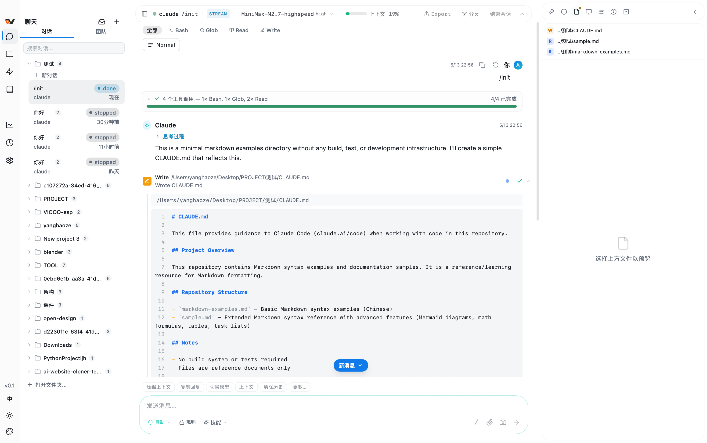
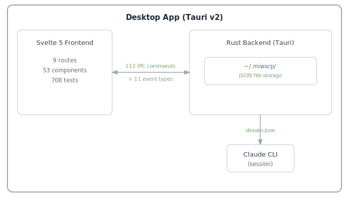

<p align="center">
  
</p>

<p align="center">
  <strong>本地优先的 AI 辅助编程桌面应用</strong>
</p>

<p align="center">
  <a href="#why-miwarp">为什么</a> &middot;
  <a href="#key-capabilities">功能</a> &middot;
  <a href="#quick-start">快速开始</a> &middot;
  <a href="#supported-providers">支持供应商</a> &middot;
  <a href="#architecture">架构</a> &middot;
  <a href="#license">许可证</a>
</p>

<p align="center">
  <a href="README.md"><b>English</b></a> | <b>简体中文</b>
</p>

---

<p align="center">
  
</p>

## 什么是 MiWarp？

MiWarp 是 [OpenCoVibe](https://github.com/shaozi/OpenCoVibe) 的分支和重大扩展版本。OpenCoVibe 是一个面向 Claude Code CLI 的桌面封装工具，而 MiWarp 已演变为功能丰富的 IDE 风格环境，显著扩展了原始项目的功能。

## 为什么选择 MiWarp？

Claude Code 等 AI 编程 CLI 功能强大，但运行在终端内。这意味着没有持久化仪表盘、没有可视化差异审查、没有跨会话历史记录，也无法切换多供应商。MiWarp 用原生桌面 UI 封装这些 CLI，添加终端无法提供的功能层——同时保持所有数据**本地存储**。（远程模型 API 需要网络访问；应用本身没有云后端。）

| Agent                                                    | 状态   |
| -------------------------------------------------------- | ------ |
| [Claude Code](https://github.com/anthropics/claude-code) | 已支持 |
| [Codex](https://github.com/openai/codex)                 | 开发中 |

**平台状态**：目前主要在 **macOS** 上开发和测试。Windows 和 Linux 构建可用，但尚未经过全面兼容性测试——欢迎贡献和错误报告。

**核心原则**：封装 CLI，呈现工作内容，保持本地化。

## 核心功能

### CLI 无法提供的功能

| 功能                 | MiWarp 新增内容                                                                                                                    |
| -------------------- | ---------------------------------------------------------------------------------------------------------------------------------- |
| **可视化工具卡片**   | 每个工具调用（Read、Edit、Bash、Grep、Write、WebFetch 等）都渲染为内联卡片，支持语法高亮差异、结构化输出和一键复制                 |
| **运行历史与回放**   | 浏览所有历史会话，完整事件回放，从任意点恢复/分支，附带恢复功能的软删除                                                            |
| **多供应商热切换**   | 使用 Claude Code 连接 15+ API 供应商（DeepSeek、Kimi、Zhipu、Bailian、DouBao、MiniMax、OpenRouter、Ollama 等）——无需重启即可热切换 |
| **远程浏览器访问**   | 嵌入式 Web 服务器，支持通过 LAN 或 HTTP 隧道（ngrok/cloudflared）访问                                                              |
| **文件浏览器**       | 浏览和编辑项目文件，支持语法高亮、Markdown 预览、图片预览和 Git 差异查看                                                           |
| **记忆编辑器**       | 创建和编辑 CLAUDE.md、项目级和用户级记忆文件，支持实时预览                                                                         |
| **Agent 管理**       | 可视化编辑器，用于创建、编辑和管理自定义 Agent 定义（.md 文件），提供表单和源码两种模式                                            |
| **权限规则**         | 在用户和项目级别管理 CLI 权限允许/拒绝规则，配合可视化规则编辑器                                                                   |
| **使用分析**         | 按模型分组的令牌明细、成本追踪、每日热力图、堆叠模型图表、会话级统计                                                               |
| **团队仪表盘**       | 以只读视图查看 Claude Code 多 Agent 团队——任务列表、队友状态、消息流                                                               |
| **活动监视器**       | 实时 Hook 事件流、工具活动时间线、文件追踪面板、带嵌套工具卡片的子 Agent 追踪                                                      |
| **插件市场**         | 浏览、安装和管理来自可视化市场的 Claude Code 插件和技能                                                                            |
| **MCP 管理**         | 发现 MCP 服务器、查看每服务器状态、重新连接/切换面板                                                                               |
| **内联权限**         | 丰富的权限审查 UI，含批量允许/拒绝面板、CLI 建议的"始终允许"规则和 AskUserQuestion 渲染                                            |
| **CLI 会话导入**     | 发现并导入现有的 Claude Code CLI 会话到 MiWarp                                                                                     |
| **Rewind**           | 检查点式选择性回滚文件变更，支持预演查看                                                                                           |
| **远程主机**         | 配置 SSH 主机用于远程 CLI 执行，提供密钥生成向导和连接测试                                                                         |
| **预览和元素选择器** | 在配套窗口中打开 localhost 预览，交互式选择页面元素，并将结构化上下文（DOM 路径、样式、HTML 片段）插入聊天                         |
| **Ralph Loop**       | 自动迭代相同提示直到满足完成条件——可配置最大迭代次数的无干预编程                                                                   |
| **Doctor 诊断**      | 针对 CLI、平台、SSH 和代理配置的系统健康检查                                                                                       |
| **定时任务**         | 使用类 cron 表达式在指定时间自动运行提示的调度功能                                                                                 |
| **工作流自动化**     | 构建和执行多步骤 AI 工作流，支持分支逻辑和工具集成                                                                                 |
| **技能市场**         | 发现和安装社区贡献的技能和工作流                                                                                                   |

### 功能列表

- **丰富聊天 UI** — Markdown、语法高亮、思考块、图片附件、文件差异、可折叠工具组
- **会话控制** — 创建、恢复、分叉、重命名会话；Plan 模式切换；模型热切换；上下文历史追踪
- **拖放** — 原生文件拖放支持图片、PDF、目录和路径引用
- **项目文件夹** — 侧边栏项目选择器，支持记忆、权限和会话的按项目作用域
- **内联斜杠命令** — `/model`、`/diff`、`/todos`、`/tasks`、`/doctor`、`/copy`、`/stats`、`/preview`、`/ralph` 等——原生应用内渲染
- **键盘快捷键** — 完全可自定义的快捷键，支持组合键和冲突检测
- **Hook 管理器** — 配置上游 CLI Hooks 实现事件驱动自动化
- **国际化** — 英语和简体中文，lightweight 响应式运行时
- **系统托盘** — 隐藏到托盘；后台会话继续运行，支持原生通知
- **深色/浅色主题** — 基于 CSS 变量的主题系统，支持 UI 缩放控制和自定义颜色编辑
- **自动更新** — 应用内更新检查器，提供下载链接
- **设置向导** — 首次启动时引导完成 CLI 检测、身份验证和供应商配置

## 快速开始

### 选项 A：下载预构建二进制文件（macOS）

从 [Releases](https://github.com/Yhazrin/MiWarp/releases) 下载最新的 `.dmg`——通用二进制文件，支持 Apple Silicon 和 Intel Mac。

> **注意**：应用未经过代码签名。首次启动时，请右键选择"打开"以绕过 macOS Gatekeeper。

### 选项 B：自动化设置（macOS）

```bash
git clone https://github.com/Yhazrin/MiWarp.git
cd MiWarp
./scripts/setup.sh          # 添加 --yes 跳过确认提示
npm run tauri dev
```

设置脚本检测缺失的依赖（Xcode CLI Tools、Homebrew、Node.js、Rust）并自动安装。

### 选项 C：手动设置

**前置要求：**

- [Node.js](https://nodejs.org/) >= 20
- [Rust](https://rustup.rs/) >= 1.75

**macOS：**

```bash
xcode-select --install
brew install node
curl --proto '=https' --tlsv1.2 -sSf https://sh.rustup.rs | sh
```

**Linux (Debian/Ubuntu)：**

```bash
sudo apt install libwebkit2gtk-4.1-dev build-essential curl wget file \
  libxdo-dev libssl-dev libayatana-appindicator3-dev librsvg2-dev
curl --proto '=https' --tlsv1.2 -sSf https://sh.rustup.rs | sh
```

**Windows：**

```powershell
# 从 https://rustup.rs 安装 Rust
# 从 https://nodejs.org 安装 Node.js
```

**构建和运行：**

```bash
git clone https://github.com/Yhazrin/MiWarp.git
cd MiWarp
npm install
npm run tauri dev
```

### 设置向导

首次启动时，MiWarp 会引导你完成：

1. **CLI 检测** — 自动检测 Claude Code CLI，如缺失则提供安装
2. **身份验证** — 15+ 供应商的 OAuth 登录或 API 密钥
3. **完成** — 开始编程

你可以随时从 **设置 > 通用 > 设置向导** 重新运行向导。

## 支持的供应商

### LLM 供应商

| 供应商                     | 端点                                           | 认证    |
| -------------------------- | ---------------------------------------------- | ------- |
| Anthropic                  | 官方 API                                       | API Key |
| DeepSeek                   | `api.deepseek.com/anthropic`                   | Bearer  |
| Kimi (Moonshot)            | `api.moonshot.cn/anthropic`                    | Bearer  |
| Kimi For Coding            | `api.kimi.com/coding/`                         | Bearer  |
| 智谱 (Zhipu)               | `open.bigmodel.cn/api/anthropic`               | Bearer  |
| 智谱 (Zhipu Intl)          | `api.z.ai/api/anthropic`                       | Bearer  |
| 百炼 (Bailian Coding Plan) | `coding.dashscope.aliyuncs.com/apps/anthropic` | Bearer  |
| 百炼 (百炼 API)            | `dashscope.aliyuncs.com/apps/anthropic`        | Bearer  |
| 豆包 (DouBao)              | `ark.cn-beijing.volces.com/api/coding`         | Bearer  |
| MiniMax                    | `api.minimax.io/anthropic`                     | Bearer  |
| MiniMax (国内)             | `api.minimaxi.com/anthropic`                   | Bearer  |
| 小米 MiMo (小米)           | `api.xiaomimimo.com/anthropic`                 | Bearer  |
| 小米 MiMo (Token Plan)     | `token-plan-cn.xiaomimimo.com/anthropic`       | Bearer  |
| 腾讯混元 (Hunyuan)         | `api.hunyuan.cloud.tencent.com/anthropic`      | Bearer  |
| 硅基流动 (SiliconFlow)     | `api.siliconflow.com/`                         | Bearer  |

### API 网关

| 平台              | 端点                      | 认证   |
| ----------------- | ------------------------- | ------ |
| Vercel AI Gateway | `ai-gateway.vercel.sh`    | Bearer |
| OpenRouter        | `openrouter.ai/api`       | Bearer |
| AiHubMix          | `aihubmix.com`            | Bearer |
| ZenMux            | `zenmux.ai/api/anthropic` | Bearer |

### 本地

| 平台                                                                   | 端点                      |
| ---------------------------------------------------------------------- | ------------------------- |
| Ollama                                                                 | `localhost:11434`         |
| [CC Switch](https://github.com/farion1231/cc-switch)                   | `localhost:15721`         |
| [Claude Code Router](https://github.com/musistudio/claude-code-router) | `localhost:3456`          |
| 自定义                                                                 | 任何兼容 Anthropic 的端点 |

## 架构

<p align="center">
  
</p>

**技术栈：**

| 层级     | 技术                                                                                                                           |
| -------- | ------------------------------------------------------------------------------------------------------------------------------ |
| 框架     | [Tauri v2](https://v2.tauri.app/) (Rust 后端 + WebView)                                                                        |
| 前端     | [Svelte 5](https://svelte.dev/) + [SvelteKit](https://svelte.dev/docs/kit/) (adapter-static)                                   |
| 样式     | [Tailwind CSS](https://tailwindcss.com/) v3 + CSS 变量                                                                         |
| 终端     | [xterm.js](https://xtermjs.org/)                                                                                               |
| Markdown | [marked](https://marked.js.org/) + [highlight.js](https://highlightjs.org/) + [DOMPurify](https://github.com/cure53/DOMPurify) |
| 国际化   | 自定义 lightweight 运行时 (en + zh-CN)                                                                                         |
| 测试     | [Vitest](https://vitest.dev/)                                                                                                  |

**Agent 通信：**

应用通过双向流式 JSON 协议（stdin/stdout）与 Claude Code CLI 通信。每个会话是由每个运行的会话 actor 管理的长期多轮进程。支持三种通信模式：流式 JSON（主要）、PTY（交互式终端）和管道（Codex）。

**数据存储：**

所有数据本地存储在 `~/.miwarp/`——无云、无数据库。

```
~/.miwarp/
├── settings.json          # 用户设置
├── runs/                  # 会话历史
│   └── {run-id}/
│       ├── meta.json      # 运行元数据
│       ├── events.jsonl   # 事件日志
│       └── artifacts.json # 摘要
└── keybindings.json       # 自定义快捷键
```

## 开发

```bash
npm install              # 安装依赖
npm run tauri dev        # 开发模式（热重载）
npm test                 # 运行测试
npm run lint:fix         # 修复 lint 问题
npm run format           # 格式化
```

## 贡献

欢迎贡献！请阅读 [CONTRIBUTING.md](CONTRIBUTING.md) 了解开发设置、代码规范和 PR 指南。

## Star History

[](https://star-history.com/#Yhazrin/MiWarp&Date)

## 许可证

根据 [Apache License 2.0](LICENSE) 获得许可。

版权所有 2025-2026 MiWarp 贡献者。
