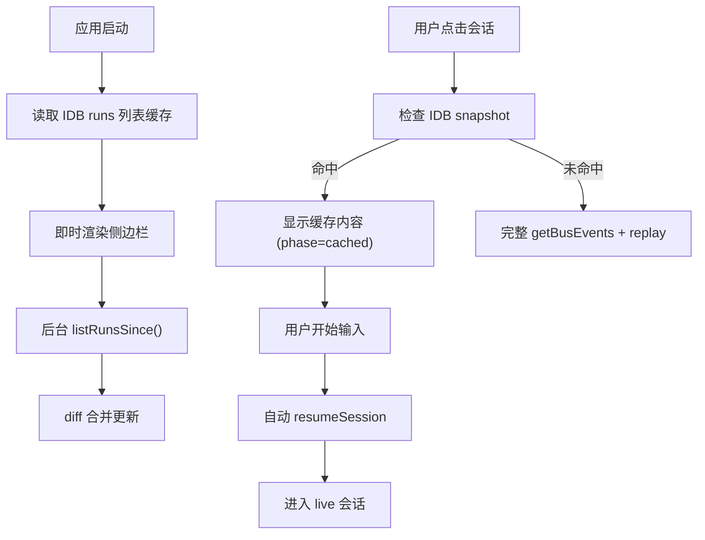

# MiWarp v1.0.6 计划书 · 下一阶段功能与实现路径

> **文档定位**：面向 v1.0.6 后续开发的"做什么 / 怎么做"手册。
> **范围**：v1.0.5 → v1.0.6 待落地的功能与多端整改续作；以"主题升级 + 技术路径"组织。
> **不收录**：已删除分支的具体提交历史与 commit hash（分支已清理，无可参考对象）。
> **配套根因级证据**：[`MultiPlatform-Hardening-2026-06-06.md`](./MultiPlatform-Hardening-2026-06-06.md)。

---

## 一、v1.0.6 旗舰特性：会话缓存加速

> **重要性**：唯一用户每天都感知、且能独立发布的性能特性。
> **当前状态**：仓库内无相关实现，需要从零落地（任务清单全部 `pending`）。

### 1.1 任务清单

| ID | 内容 | 状态 |
| --- | --- | --- |
| `runs-list-cache` | 新增 IDB runs 列表缓存模块（`runs-list-cache.ts`），实现启动时即时渲染侧边栏 | pending |
| `layout-cache-integration` | 修改 `+layout.svelte` 的 `loadRuns` 为 cache-first + 后台同步模式 | pending |
| `cached-phase` | 在 session-store 中新增 `cached` phase，snapshot 命中时延迟 resume | pending |
| `lazy-resume-trigger` | 在 chat page 中实现用户发送消息时自动触发 lazy resume | pending |
| `snapshot-running-support` | 扩展 snapshot-cache 支持 running 状态会话的缓存（标记 `partial`） | pending |
| `ui-indicators` | 添加 UI 状态指示器（缓存加载 vs 实时连接的视觉区分） | pending |

### 1.2 现状与瓶颈

- `list_runs()` 遍历 `~/.miwarp/runs/` 下所有目录，读取 `meta.json` + `events.jsonl`（统计行数、最后活动时间等），磁盘 IO 密集
- `loadRun()` 需要从后端拉取 bus events → reducer 回放（snapshot 缓存只覆盖 terminal/idle 状态，首次打开或 running 状态会走完整回放）
- 现有的 `snapshot-cache.ts`（IndexedDB）缓存了单个会话的 reducer 输出，但仅对 terminal/idle 会话生效，且侧边栏列表完全没有缓存
- resume 时会先删除 snapshot 再重新加载

### 1.3 主题升级

- 用户感知：从"加载中…"白屏 → 即时显示
- 资源消耗：用户不输入就不 spawn 进程
- 后台一致性：IDB 缓存与磁盘数据有偏差时靠后台增量同步收敛

### 1.4 技术路径（三阶段）

#### Phase 1：侧边栏列表 IDB 缓存（最大感知提升）

- 新增 `src/lib/utils/runs-list-cache.ts`：基于 IndexedDB 存储 `TaskRun[]` 列表快照
- 修改 `src/routes/+layout.svelte` 的 `loadRuns()`：
  1. 启动时先 `await readRunsListCache()` → 立即渲染侧边栏
  2. 后台 `listRuns()` / `listRunsSince()` 拿到最新数据后，diff 合并并更新 IDB

#### Phase 2：延迟 Resume（Lazy Resume）

- 修改 `src/lib/stores/session-store.svelte.ts`：
  - 新增 phase `"cached"` — 表示"从 snapshot 加载了历史内容，CLI 进程尚未启动"
  - `loadRun()` 对 terminal/idle 会话 snapshot 命中时，设为 `"cached"` 而非 `"completed"/"idle"`
- 修改 `src/routes/chat/+page.svelte` 的消息发送逻辑：
  - 当 `phase === "cached"` 且用户发送消息时，自动触发 `resumeSession(runId, "resume", message)`
  - 用户视角：看到历史 → 输入 → 发送 → 自动恢复会话并发送

#### Phase 3：Snapshot 缓存增强

- `running` 状态的会话在切走时也保存 snapshot（带 `partial: true` 标记），切回时先显示缓存内容，再增量追加新 events
- resume 时不立即删除 snapshot，而是保留给 UI 展示，等 `session_init` 收到后再标记失效

### 1.5 数据流（优化后）



### 1.6 风险与注意事项

- 数据一致性：IDB 缓存可能落后于磁盘数据（如另一个终端修改了会话），需靠后台增量同步修正
- Lazy resume 时机：如果用户只是查看历史不输入，不应 spawn 进程（省资源）
- snapshot 失效：运行中会话的 snapshot 可能不完整，需标记 `partial: true` 并在展示时提示

### 1.7 影响范围

- `src/lib/utils/runs-list-cache.ts`（新增）
- `src/routes/+layout.svelte`（loadRuns 增加缓存层）
- `src/lib/stores/session-store.svelte.ts`（新增 "cached" phase + lazy resume 逻辑）
- `src/lib/stores/types.ts`（SessionPhase 类型扩展）
- `src/routes/chat/+page.svelte`（发送消息时的 lazy resume 触发）
- `src/lib/utils/snapshot-cache.ts`（扩展 running 状态支持）

### 1.8 验收标准

1. 冷启动 → 侧边栏 < 100ms 出现上次的会话列表
2. 点击 idle 会话 → < 50ms 渲染历史（来自 IDB snapshot）
3. 点击 idle 会话后只看不发 → 进程不 spawn（系统进程列表验证）
4. 发送消息 → 自动触发 resume，无感知衔接
5. running 会话切走再回 → 先显示 `partial: true` 标记的旧内容，再增量追平

---

## 二、多端整改续作（C5 / C6 / D3 / D4 / D5）

> **根因级证据**：见 [`MultiPlatform-Hardening-2026-06-06.md`](./MultiPlatform-Hardening-2026-06-06.md) 的 C5 / C6 / D3 / D4 / D5 章节。
> **本计划相关性**：这些是 hardening 文档里**已识别但还未落地**的整改项，全部纳入 v1.0.6 范围。

### 2.1 C5：协议对齐 / 缓存对齐（Android 缺失项补齐）

- **主题升级**：iOS / Android 走相同的协议层和缓存层，端到端体验对齐
- **技术路径**：
  - 把 iOS 的 4 块核心（`BusEventCache` 磁盘暖路径 / `ArtifactCache` LRU 磁盘缓存 / 截断 View Full 机制 / preflight HTTP 探测）封装为跨语言协议描述（YAML 或 OpenAPI 子集），作为 single source of truth
  - Android 按描述实现 Kotlin 等价物
- **验收**：Android 冷启动到首屏与 iOS 相差 ≤ 100ms

### 2.2 C6：iPadOS size class 巩固

- **主题升级**：iPad mini / Stage Manager / Split View 切换不再"先 compact 后 regular"双次重排
- **技术路径**：
  - 主断点换为 `@Environment(\.horizontalSizeClass)`，仅在需要具体像素值时用 GeometryReader
  - `columnVisibility` 改为 `@State` 让用户可折叠；持久化到 UserDefaults
  - 在 11" / 13" iPad Pro 横屏下追加 expanded 档（`detailMaxWidth = 1100` 等）
- **验收**：iPad mini 竖横切换、Stage Manager resize 不再有"先 compact 后 regular"的双次重排

### 2.3 D3：设计系统三档断点

- **主题升级**：iOS / Android 三档 size class 标准化
- **技术路径**：
  - iOS `MWAdaptiveLayout` 增加 `medium` 档（768-1024pt），数值介于 compact 与 expanded
  - Android `MWTypography.kt` 改用 `MaterialTheme.typography` 的 Material 3 Type Scale，自动响应 fontScale

### 2.4 D4：iOS / Android UI 鸿沟补齐

- **主题升级**：iOS / Android 关键能力对等
- **技术路径**：
  - Session 过滤：Android 抄 iOS 的 `SessionFiltersView` 等价物 + `SwipeToDismissBox`
  - Artifact 预览：Android 接入 `strings.xml`；diff 视图加横向 `Modifier.horizontalScroll()`
  - ComposerBar 能力：Android 补附件按钮、provider 信息 chip
  - ChatHeader 控件：Android 改 `IconButton(onClick=...)` 配 `contentDescription`

### 2.5 D5：移动端细节补齐

- **主题升级**：iOS / Android 体验粗糙点全部打磨
- **技术路径**：
  - iOS tool 输出展开后仍 15 行 → 展开态 `lineLimit(nil)`
  - iOS / Android 代码块无横向滚动 → 包 `ScrollView(.horizontal)` / `Modifier.horizontalScroll()`
  - iOS 暗色闪烁：初值改 `@Environment(\.colorScheme)` 读取
  - Android 动态色：API 31+ 用 `dynamicLightColorScheme` / `dynamicDarkColorScheme`，旧版本回退
  - 可访问性：两端 bubble 加 `accessibilityElement(children: .combine)` / `Modifier.semantics { contentDescription = ... }`
  - 动态字体：iOS 改 `Font.system(.body)` 自动响应 Dynamic Type；Android 改用 Material Typography token

---

## 三、性能与稳定性深化

> 配套根因：见 hardening 文档的 A1 / A2 / A3 / A4 / B1 / B2 / B3 / B4 / C1 / C2 / C3 / C4 章节。

### 3.1 虚拟滚动（500 条消息 60fps）

- **主题升级**：长会话不掉帧
- **技术路径**：
  - 短期：`contentVisibilityEnabled` 还原为 `true`（0 成本提速）
  - 中期：把 `ChatTimelineEntries` 接入 `VirtualList` 组件（`entry.id` 为 key），`IntersectionObserver` 回写动态高度
  - `seqByMessageId` 维护移到 `SessionStore._reduce` 的 `message_complete` 分支，消除组件层的第二路 Tauri 监听

### 3.2 输入打字 rAF 合并 / ResizeObserver 节流

- **主题升级**：高频敲字 < 32ms 响应
- **技术路径**：
  - `PromptInput` 内 8 处 `requestAnimationFrame(autoResize)` 合并成单个 `pendingResize` 标志，每帧最多 commit 一次
  - `ResizeObserver` 改 `box: "border-box"` + rAF 节流
  - git branch 轮询从 PromptInput 移到 SessionStore 单例 + `document.visibilitychange` 唤醒拉取

### 3.3 主题切换动画

- **主题升级**：避免切换主题时的全屏重绘风暴
- **技术路径**：
  - 优先用 View Transitions API（GPU 合成）
  - 旧浏览器降级到 `.theme-transitioning` 定向选择器（只对顶层 shell 元素）
  - 移除原 `html.theme-transitioning *` 通配符
  - `.theme-fade` opt-in 给 box-shadow / fill / stroke 等开销大的属性

### 3.4 streamingText 微任务批处理

- **主题升级**：5k token 长回答不掉帧
- **技术路径**：`applyEvent` 单条入口里把 delta 推进 `pendingDeltas: string[]`，下一个 microtask 一次性 `streamingText += pendingDeltas.join("")`

### 3.5 WS 256KB chunking

- **主题升级**：突破单 WS 帧 1MB 限制，承载大消息
- **技术路径**：
  - 服务端：新增 `send_envelope()` helper，sniff 渲染后 JSON 长度，`> WS_CHUNK_THRESHOLD (256KB)` 时切成 `chunk_begin` / `chunk{N}` / `chunk_end` 三元组，`msg_id` (uuid v4) 关联
  - 每片 192KB，4 帧 + envelope 控制在 1MB 以内
  - 客户端：buffer by `msg_id`，lock-protected 重组，replay 给 `handleMessage`
  - 必须在客户端两端同步发布

### 3.6 since_seq 增量历史

- **主题升级**：断网 / 切到后台再回来秒级同步
- **技术路径**：
  - iOS `BusEventCache` 持久化 `lastSeq` watermark，`readEntry(runId:)` 返回 `(events, lastSeq)`
  - `MiWarpEventReducer.appendHistory(_:)` 不重置 reducer 状态，按 id + seq 去重
  - `ChatViewModel.loadHistory` 传 `sinceSeq` 给 `getBusEvents`，merge 新片
  - 冷启动无 cache 仍走全量

### 3.7 移动端断联感知

- **主题升级**：从分钟级重连降到秒级
- **技术路径**：
  - iOS：`NWPathMonitor` + `scenePhase` 唤醒；指数退避加 bounded jitter
  - iOS：新增 `reconnectImmediate()` 在网络恢复时绕过 backoff
  - Android：`ConnectivityManager.NetworkCallback` 注册/反注册
  - 服务端：axum 心跳 300s → 30s

### 3.8 A1 隔离机制可观察（CLI 卡死不再静默）

- **主题升级**：CLI 卡死时不再 70s 静默
- **技术路径**：
  - 后端：进入隔离时 emit `SessionRecovering { reason, deadline_ms, from_internal }`，退出时 emit `SessionRecovered { ok }`
  - `QUARANTINE_DEADLINE` 10s → 5s
  - 前端：`RecoveringBanner` 顶部非阻塞 banner，500ms 倒计时

### 3.9 A2 协议 desync 检测

- **主题升级**：JSON 解析失败不再静默
- **技术路径**：
  - 60 秒滑动窗口，5 次失败阈值
  - 超阈值 emit `ProtocolDesync { sample, fail_count }`，`sample` 取首 200 字节
  - 强制 `RunState::Failed { reason: "protocol_desync" }` 推 turn 引擎

### 3.10 A3 Slash cold start

- **主题升级**：未启动 session 也能用 `/`
- **技术路径**：
  - `slashEnabled` 改为 `agent === "claude"` 单条件
  - `+layout.svelte` 启动时 `loadCliInfo()` 预热 CLI 命令缓存
  - `SlashMenu` 新增 `showBuiltInOnlyBanner` prop

### 3.11 A4 OS 通知后端

- **主题升级**：长 run 完成 / 失败 / 定时任务完成能收到系统通知
- **技术路径**：
  - 跨平台 `tauri_plugin_notification`
  - `session_actor.handle_eof` 路径根据 `app.is_focused()` 决定是否 emit
  - `should_notify_terminal_state` 抑制 internal-turn-driven 通知噪音
  - `notification-listener` 路由 `task_notification.completed/failed`

---

## 四、智能体能力扩展

### 4.1 Context Relay 系统

- **主题升级**：跨上下文传递 snippet（选中文本 → 对面会话）
- **技术路径**：
  - 类型层：`context-clip-types.ts` 定义 clip 形状
  - 服务层：`context-relay-service.ts` 写入 IPC
  - Store：`context-relay-store.svelte.ts` 管理 clip 队列
  - UI：`ContextClipCard` / `ContextRelayButton` / `ContextRelayModal` / `SelectionFloatingToolbar`
  - Builder：`context-clip-builder.ts` 把选中文本转为 clip

### 4.2 Virtual Commands 体系

- **主题升级**：chat 中 `/` 命令不再硬编码
- **技术路径**：`virtual-commands.ts` 抽离虚拟命令逻辑；`useChatHandlers` 改为 delegation 模式

### 4.3 CLI 2.1.152+ Slash 同步

- **主题升级**：跟上游 CLI 协议同步
- **技术路径**：
  - `/simplify`（CLI 2.1.154，cleanup-only review）加入双表
  - `/reload-skills`（CLI 2.1.152）加入双表
  - `MessageDisplay` hook 事件类型加入 `HookEventType` + `HOOK_EVENT_TYPES`
  - 回归测试覆盖三个新命令 + 新事件

### 4.4 中文顿号「、」触发 Slash

- **主题升级**：中文用户输入习惯
- **技术路径**：在 slash 菜单触发器中识别「、」符号，等价于「/」

### 4.5 CLI idle-aware flush

- **主题升级**：首 token 流式延迟降低
- **技术路径**：100ms idle gap 后走 `queueMicrotask` 而非 `requestAnimationFrame`（~16ms）；提取 `_IDLE_GAP_MS` 常量

### 4.6 MessageDisplay hook 事件

- **主题升级**：CLI 2.1.152 引入的 `MessageDisplay` hook 类型在 hook 系统中识别
- **技术路径**：`HookEventType` 增加新值；`hook-helpers.ts` 注册

### 4.7 HTML 会话洞察报告

- **主题升级**：会话结束后可导出 HTML 报告
- **技术路径**：复用 `useExportController` + `html-export` 工具；走 IPC 写文件

### 4.8 AgentTaskStack

- **主题升级**：多 agent 同时工作时任务堆栈可视化
- **技术路径**：`AgentTaskStack.svelte` 渲染任务堆栈；后端 task 事件订阅

---

## 五、侧边栏与导航

### 5.1 记忆侧边栏组件

- **主题升级**：memory 在 sidebar 不再散落
- **技术路径**：`MemorySidebarGroup.svelte` 独立组件；按时间 / 类型分组

### 5.2 Memory 语义块

- **主题升级**：memory 文件保留 type / level / children 层级
- **技术路径**：
  - `parseMemoryFileContent()` 增强版保留语义块
  - `MemoryBlock` / `MemoryBlockType` / `ParsedMemoryFile` 类型
  - `MemoryBlockItem.svelte` 按类型显示

### 5.3 Streaming Skeleton

- **主题升级**：流式响应不闪烁
- **技术路径**：
  - `StreamingSkeleton.svelte` shimmer 动画
  - `MarkdownContent` 流式 < 100 字符时显示 skeleton；`<pre>` 包 `min-h-[3em]` 容器
  - `InlineToolCard` 在 `isInputStreaming` 时延迟 300ms 展开
  - `ToolDetailView` 流式 output 显示 skeleton

### 5.4 Git Worktree 集成

- **主题升级**：worktree 可视化
- **技术路径**：
  - `GitWorktreePanel.svelte` 显示 git status + worktree 列表 + session chain
  - `git-worktree-store.svelte.ts` 状态管理
  - 数据流：chat page → `ToolActivity` → `WorkspaceContextPanel` → `GitWorktreePanel`

### 5.5 Worktree branch badge

- **主题升级**：用户在 worktree 模式时 status bar 显示当前 branch
- **技术路径**：`SessionStatusBar` 加 worktree branch badge（图标 + 名称）

### 5.6 多会话 worktree 并行

- **主题升级**：多分支并行开发时每个分支独立 session
- **技术路径**：`GitWorktreePanel` 拓展 session chain 视图；每个 worktree 关联独立 `sessionId`

### 5.7 Session folder 管理

- **主题升级**：会话可分组
- **技术路径**：sidebar 显示 folder 树 + drag-drop 重排

### 5.8 Session 硬删除

- **主题升级**：彻底删除会话
- **技术路径**：API 新增 `hard_delete_session`；UI 二次确认对话框

### 5.9 History 搜索模式切换 + Memory 上下文菜单

- **主题升级**：history 页可切换搜索模式，memory 有上下文菜单
- **技术路径**：`history` 页加 mode toggle（关键词 / fuzzy / by date）；memory block 右键出菜单

### 5.10 Settings toggle 一致性

- **主题升级**：settings 各种 toggle 视觉统一
- **技术路径**：统一 `SettingsToggle.svelte` 状态机、disabled / loading 态

### 5.11 Session 自动恢复

- **主题升级**：刷新 / 重启应用自动恢复上次活跃 session
- **技术路径**：`SessionStore` 持久化 `activeSessionId` 到 localStorage；启动时回放

---

## 六、页面与组件

### 6.1 Scheduled Tasks 页面重新设计

- **主题升级**：从单列变成 400+ 详情双栏
- **技术路径**：
  - 400px task list + flexible detail panel
  - 26px bold title 匹配 chat 风格
  - left accent bar 选中态
  - 2x2 meta grid + prompt card copy button
  - 结构化 timeline execution history

### 6.2 Plugins 升级到 Extensions Center

- **主题升级**：从"列表"升级为"市场"语义
- **技术路径**：
  - 9x9 icon containers + 2xl 数字
  - 推荐操作卡片 + chevron arrow on hover
  - 类型指南卡片（plugins / skills / hooks / mcp）
  - 统一 `border-border/60 + bg-card/50` 卡片
  - uppercase tracking-wide 段落标题

### 6.3 ElicitationDialog redesign

- **主题升级**：自适应宽度 + chip 风格按钮
- **技术路径**：content-adaptive width；chip UI 按钮

### 6.4 Workspace menu

- **主题升级**：workspace 顶栏菜单直接到功能
- **技术路径**：菜单挂载到 `WorkspaceContextPanel` 顶栏，三项：open dir、rename alias、settings

### 6.5 LinkCard redesign

- **主题升级**：链接卡片极简化
- **技术路径**：minimal style + context capsule 默认态；rail logo 移除

### 6.6 Island capsule UI

- **主题升级**：输入胶囊 UI 重做
- **技术路径**：
  - 单行 capsule，圆角 `rounded-full` ↔ `rounded-[1.75rem]` 自动切换
  - 内部嵌入 placeholder / mode picker / send button
  - 整合 scheduled tasks 面板快捷入口

### 6.7 Bits UI 全面迁移

- **主题升级**：组件库从手写 overlay 统一到 bits-ui 包装
- **技术路径**：
  - `MiDialog` / `MiPopover` 包装 bits-ui
  - `MiDialog` 新增 `xl / sheet / fullscreen / lightbox` 尺寸
  - 新增 `MiConfirmDialog` 复用 confirm 流程
  - 替换 30+ 个组件内手写 overlay

### 6.8 Process Visibility 选择器

- **主题升级**：用户可设置 process visibility
- **技术路径**：`ProcessVisibilityPicker.svelte`；接入 `useProcessVisibility.svelte.ts` + `process-visibility.ts` 工具

### 6.9 Settings 页分 Tab

- **主题升级**：settings 页面从单文件拆成多 Tab
- **技术路径**：
  - `ConnectionTab.svelte`（762 行）
  - `CliConfigTab.svelte`（501 行）
  - `GeneralTab.svelte` 抽出
  - 共享 `use-connection-platform.svelte.ts` composable

### 6.10 Status Bar 重组

- **主题升级**：status bar 拆分 side panel tabs + 整合多状态
- **技术路径**：
  - `SessionStatusBar` 拆分 model / fast / status / worktree / etc.
  - 整合 side panel tabs
  - 引入 `tool-panel-tab.ts` 工具

### 6.11 Toast exit animation + Chat input focus ring

- **主题升级**：toast 消失有动画，chat input 焦点可视
- **技术路径**：`MiToast` 新增 exit animation；`ChatInput` 焦点态加 `focus-visible:ring-2 ring-ring`

---

## 七、智能体个性化

### 7.1 智能体头像系统（Mascots）

- **主题升级**：用户可定制 AI 形象
- **技术路径**：
  - `AgentIdentity.svelte` + 设置持久化
  - `mascot-overrides.svelte.ts`
  - `AgentAppearanceSettings.svelte` UI
  - `feishu-card-mascots.ts` 飞书卡片集成

### 7.2 智能体背景设置

- **主题升级**：用户可为每个 agent 选背景
- **技术路径**：`BackgroundPicker.svelte`；`background-store.svelte.ts`；`types/background.ts`

---

## 八、设计系统 / i18n / a11y

### 8.1 主题令牌系统（Tailwind opacity 修饰符启用）

- **主题升级**：颜色 / spacing 统一语义，跨三端 token 化
- **正确形态**（必须遵守的当前规范）：
  - `tailwind.config.ts` 用 `hsl(var(--xxx) / <alpha-value>)` 模式（保留 `hsl()` 包裹，让 Tailwind v3 的 `<alpha-value>` 占位生效）
  - 业务代码用 `bg-miwarp-xxx/10` 这样的 Tailwind opacity 修饰符（不是 `bg-[hsl(var(--xxx)/0.5)]`）
  - 新增 `miwarp-glass-bg` / `miwarp-glass-border` token
  - 涉及 69+ 个组件文件
- **反模式**（绝对不要做）：把 `hsl(var(--xxx))` 改成 `var(--xxx)` 直接暴露 — 那种写法会破坏 Tailwind opacity 修饰符的解析，回归表现为"9 天全局颜色失效"（黑边旧版）。最终落地必须以 `hsl(var() / <alpha-value>)` 为准

### 8.2 iOS 触觉反馈

- **主题升级**：状态切换有触觉反馈
- **技术路径**：`Haptics.success() / .warning() / .error()` 在 toast / 任务完成 / 错误时触发

### 8.3 主题令牌迁移（iOS / Android）

- **主题升级**：iOS / Android 所有 semantic colors 改为 miwarp tokens
- **技术路径**：
  - iOS：所有 hardcoded 色值换为 `MWColors` token
  - Android：所有 `.copy(alpha=...)` 调用换为 subtle token
  - 涉及 `MWComponents` / `SessionFilters` / `AppNavGraph` / `ChatInputBar` / `DiffPreviewView` 等

### 8.4 i18n 完整覆盖

- **主题升级**：硬编码字符串全部走 `t()`
- **技术路径**：覆盖 `CronVisualEditor` / `McpStatusPanel` / `SkillEditor` / `TaskExecutionMonitor` / `AgentEditor` / `ContextWindowVisualizer` / `SkillPreviewDialog` / `FileArtifactCard` / `Sidebar` / `CommandPalette` 等

### 8.5 可访问性标签

- **主题升级**：screen reader 可用
- **技术路径**：
  - iOS `MWInputBar` 按钮 + toast dismiss + copy 按钮全部加 `accessibilityLabel`
  - Android `ChatHeader` `IconButton` + `contentDescription`
  - Desktop `5 个 role="switch"` 按钮加 `focus-visible`
  - 所有 `<select>` 加 `focus-visible:ring-2 ring-ring`

### 8.6 错误分类 i18n

- **主题升级**：错误提示按 category 分别本地化
- **技术路径**：`error_category_*` / `error_guidance_*` / `error_openSettings` 键加入 `en.json` / `zh-CN.json`

---

## 九、状态管理与存储

### 9.1 Singleton SessionStore

- **主题升级**：跨页面导航不丢 session
- **技术路径**：`SessionStore` 单例 + 模块级状态；`+layout.svelte` 启动时 `initSessionStore()`

### 9.2 PromptInputStore + ChatPageStore

- **主题升级**：输入框状态在父子组件间共享
- **技术路径**：抽出 `PromptInputStore.svelte.ts` + `ChatPageStore.svelte.ts`，避免 props 透传

### 9.3 Task 排序工具

- **主题升级**：调度任务排序逻辑统一
- **技术路径**：`sortTasksByPriority` 工具提取到 `utils/`；`virtual-commands` 复用

### 9.4 版本号单一来源

- **主题升级**：版本号只来自 `package.json`
- **技术路径**：`version:sync` 脚本从 `package.json` 同步到 `tauri.conf.json` + `Cargo.toml`；UI 显示真实版本；updates 指向 `Yhazrin/miwarp`

### 9.5 本地 Scheduled Tasks 系统

- **主题升级**：定时任务后端 + UI 完整闭环
- **技术路径**：
  - Rust 后端：scheduler 模块 + 模型 + runner
  - 前端：完整 UI + Cron 可视化编辑器
  - 飞书 webhook
  - 任务执行监控 + dashboard

---

## 十、性能工程

### 10.1 共享 Spinner 组件

- **主题升级**：loading 视觉统一
- **技术路径**：`Spinner.svelte`（xs/sm/md/lg/xl 尺寸）；替换 14+ 处手写 `animate-spin`

### 10.2 共享 Modal 组件

- **主题升级**：弹窗组件统一
- **技术路径**：plugins 页内联 modal 转共享 `Modal` 组件

### 10.3 共享工具

- **主题升级**：工具函数统一
- **技术路径**：
  - `formatSize()` 统一为 `formatBytes()`
  - `StatusIcon` 硬编码 emerald 改为 CSS 变量
  - `ProjectCwdKey` 常量集中

### 10.4 P4 性能与工程优化

- **主题升级**：批量性能优化
- **技术路径**：
  - `BufWriter` for event writes
  - 单例 HTTP client
  - 序列化日志
  - 合并 derived filters
  - 去重 `stripAnsi`
  - 修 effect deps
  - bound `hookEvents` / `persistedFiles` 增长
  - 错误边界 + a11y backdrops

### 10.5 5 高频 UX 优化

- **主题升级**：高频操作一键可达
- **技术路径**：5 处高频 UX 改动（具体落地时确认）

### 10.6 Lazy-load diff library

- **主题升级**：主 bundle 减重 ~30KB
- **技术路径**：`ToolDetailView` 中 diff 库改为动态 import

### 10.7 Timeline scanning & ToolActivity derived 优化

- **主题升级**：长会话 chat 页响应更快
- **技术路径**：timeline 扫描算法改进 + ToolActivity derived 计算缓存

---

## 十一、移动端原生客户端（MiWarp Mobile）

### 11.1 iOS + Android 双客户端

- **主题升级**：从 web-only 升级到 production-grade 原生客户端
- **技术路径**：
  - `apps/ios/MiWarpMobile`：SwiftUI + `AppRouter` + `ComposerBar` + 完整设计系统 `MWComponents` / `MWTheme` / `MWAdaptiveLayout`
  - `apps/android/MiWarpMobile`：Kotlin + Jetpack Compose + `AppNavGraph` + `MWComponents` / `MWTheme` / `MWAdaptiveLayout`
  - WebSocket 桥接本地 Web 模式
  - iOS 离线缓存 `BusEventCache`
  - Android 通过 `ConnectivityManager` 网络感知
  - 共用协议：JSON envelope + `msg_id` + `chunk_*` + `since_seq`

---

## 十二、CI / 工程化

### 12.1 Backfill Linux release assets

- **主题升级**：从 tag 反推 Linux release
- **技术路径**：`.github/workflows/backfill-release-linux.yml` 手动 workflow，从已有 tag 重新打 Linux 资源

### 12.2 CI 在 feature 分支触发

- **主题升级**：CI workflow 在 feature 分支上跑
- **技术路径**：`.github/workflows/` 触发条件放宽到 feature 分支

---

## 十三、复现优先级建议

按"用户感知价值 / 实现独立性"排：

1. **高优先级**（用户每天用，单独可发布）：
   - 会话缓存加速（第一章）
   - 多端整改续作 C5 / C6（第二章）
   - 移动端 Markdown 渲染 + iMessage 气泡
   - 移动端断联感知（3.7）
   - A1 隔离可观察 + A4 OS 通知（3.8 / 3.11）
   - Context Relay（4.1）
   - Scheduled Tasks 重新设计（6.1）
   - Extensions Center 升级（6.2）
   - Bits UI 全面迁移（6.7）

2. **中优先级**（性能 / 体验提升）：
   - 桌面端性能三件套（3.1 / 3.2 / 3.4）
   - WS chunking + since_seq（3.5 / 3.6）
   - 智能体头像 / 背景（第七章）
   - 主题令牌系统（8.1，务必按正确形态落地）

3. **低优先级**（基础设施 / 长期投资）：
   - 移动端原生客户端（第十一章）
   - Settings 分 Tab（6.9）

---

## 附录 A · MultiPlatform-Hardening 整合摘要

> **完整版**：见 [`MultiPlatform-Hardening-2026-06-06.md`](./MultiPlatform-Hardening-2026-06-06.md)（368 行，4 份并行代码审计合并产物，每条问题给到 `file:line` 级证据 + 可执行修复方案）。
> **本附录作用**：把那份指南的根因 / 验收 / 工作量估算与本计划对应章节对齐，避免信息分散。

### A.1 优先级速览

| Sprint | 指南章节 | 关键修复 | 已落入本计划 |
| --- | --- | --- | --- |
| **Sprint 1（救火）** | A1, A2, A4, B3, C1, C2, C4, D2 | 隔离可观察、parse-fail 阈值、OS 通知、移除主题通配符、并行 init、增量 history、断联感知、键盘 inset | 第三章（3.3, 3.7, 3.8, 3.9, 3.10, 3.11）/ 移动端章节 |
| **Sprint 2（打磨）** | A3, B1, B2, B4, C3, C5, C6, D1, D3, D4, D5 | slash 提前可用、虚拟滚动、autoResize 合并、双订阅消除、消息分片、协议对齐、size-class 重构、对话长按菜单、Android 双栏、UI 鸿沟 | 第三章（3.1, 3.2, 3.4, 3.5）/ 第二章（C5, C6, D3, D4, D5）|

### A.2 根因级证据（精选）

> hardening 文档的"file:line 级根因 + 现象 + 修复"三段式，与本计划的"主题升级 + 技术路径"互为补充 — 本计划讲 WHAT / HOW，hardening 讲 WHY / WHERE。

#### A1：隔离机制对用户假死

- **现象**：聊天界面长时间无响应（最坏 70s 静默）
- **根因**：`session_actor.rs` quarantine 状态吞 stdout 不发事件 + `QUARANTINE_DEADLINE = 10s` + `INTERNAL_HARD_TIMEOUT = 60s`
- **本计划对应**：3.8 — `SessionRecovering` / `SessionRecovered` BusEvent + 5s deadline
- **验收**：SIGSTOP CLI → 1s 内出现 banner → 5s 后看到 failed

#### A2：CLI 同步丢失

- **现象**：前端显示 running 但 CLI 已空闲；切走再切回"突然"同步上
- **根因**：parse 失败三路降级；`json_parse_fail_count` 无阈值
- **本计划对应**：3.9 — 60s 滑动窗口 + 5 次阈值 + `ProtocolDesync` 事件

#### A3：Slash 调不出来

- **现象**：未启动会话时 `/` 无反应
- **根因**：`slashEnabled = agent === "claude" && !!useStreamSession()` 依赖 `run.execution_path === "session_actor"`
- **本计划对应**：3.10 — 改为 `agent === "claude"` 单条件 + 启动预热 `loadCliInfo()`

#### A4：通知匮乏

- **现象**：长 run 跑完无 OS 通知
- **根因**：`notify.rs` 仅在三处调，handle_eof 路径没调
- **本计划对应**：3.11 — 跨平台 `tauri-plugin-notification` + `should_notify_terminal_state` + `task_notification` handler

#### B1：大量消息渲染慢

- **现象**：200+ 条消息滚动掉帧
- **根因**：`ChatTimelineEntries.svelte` 全量渲染；`contentVisibilityEnabled` 硬编码关；组件自己开 `bus-event` 监听
- **本计划对应**：3.1 — VirtualList 接入 + `seqByMessageId` 移到 SessionStore

#### B2：输入打字 lag

- **现象**：高频敲字光标跟手延迟
- **根因**：`PromptInput.svelte` 8 处 `requestAnimationFrame()` + 10s git branch 轮询
- **本计划对应**：3.2 — 合并 `pendingResize` 标志 + ResizeObserver rAF 节流

#### B3：动画卡顿（主题切换 + glass blur）

- **现象**：切换主题全屏抖动
- **根因**：`app.css` `html.theme-transitioning *` 通配符 6 条 transition；`InlineToolCard` 5 处 glass-card
- **本计划对应**：3.3 — View Transitions API + 定向选择器 + 降级策略

#### B4：事件压力 / 双订阅

- **现象**：streaming 大 token UI 偶发掉帧
- **根因**：单条事件路径无 ctx 直接 `streamingText += ev.text`；`ChatTimelineEntries` 独立 bus-event 监听
- **本计划对应**：3.4 — 微任务批处理 + 移除组件层监听

#### C1：移动端连接慢（串行 init）

- **现象**：进入 chat 200-500ms 空白
- **根因**：`ChatView.task` 串行 `await loadHistory()` → `subscribeToEvents()`
- **本计划对应**：3.7 配套 / 移动端章节

#### C2：移动端断联

- **现象**：电梯出来后 App 断联 1-2 分钟
- **根因**：iOS 心跳 30s vs 服务端 300s；无 NWPathMonitor / scenePhase / ConnectivityManager
- **本计划对应**：3.7 — heartbeat 30s + NWPathMonitor + jittered backoff

#### C3：传输无分片

- **现象**：大 artifact 触发 "Message too long" → 断联 → 重连 → 同帧重放死循环
- **根因**：自研 JSON-RPC 无 jsonrpc / 无批量 / 无分片
- **本计划对应**：3.5 — 256KB chunking

#### C4：同步全量替换

- **现象**：每次进 chat 从 0 重放历史
- **根因**：`BusEventCache` 无 seq 索引；`loadHistory()` 无 `since_seq` 参数
- **本计划对应**：3.6 — `since_seq` watermark

#### C5：协议对齐 / 缓存对齐（移动端跨语言）

- **现象**：iOS 有的功能 Android 没有
- **根因**：Android 缺 `BusEventCache` 磁盘 / `ArtifactCache` LRU / 截断 View Full / preflight
- **本计划对应**：2.1

#### C6：iPadOS size class

- **现象**：iPad mini 竖屏 768pt 临界点行为飘忽
- **根因**：`MWAdaptiveLayout` 单一断点；`columnVisibility: .constant(.all)`
- **本计划对应**：2.2

#### D2：对话页元素优化

- **现象**：键盘遮挡最后一条 / streaming 不跟随 / 气泡无长按
- **根因**：`MessageListView` 注释 / 监听 `last?.id` / 无 `.contextMenu`
- **本计划对应**：移动端章节

### A.3 联调与验收

每个 P0 修完后跑：

```bash
npm run verify                              # 桌面端全栈门禁
xcodebuild test -scheme MiWarpMobile \
  -destination 'platform=iOS Simulator,name=iPhone 15'
./gradlew :app:testDebugUnitTest           # Android
```

外加三类手工冒烟：
1. **桌面**：50 个工具卡会话滚动 + 主题切换 + 主动断 CLI 看 banner / OS 通知
2. **iOS**：iPhone + iPad + iPad mini Split View + 飞行模式切换 + 前后台
3. **Android**：手机 + 折叠屏 expanded + 网络切换 + 大 artifact

---

## 附录 B · 发布前自检清单

- [ ] **缓存加速落地**：第一章 6 个 pending 任务全部完成并通过验收（1.8 五条）
- [ ] **`npm run version:sync`**：把 `package.json` 升到 `1.0.6`，同步到 `tauri.conf.json` + `Cargo.toml`
- [ ] **`pnpm check`**：0 错 0 警
- [ ] **`pnpm lint`**：0 警
- [ ] **`pnpm test`**：全部通过
- [ ] **`pnpm i18n:check`**：en.json / zh-CN.json 对齐
- [ ] **`npm run verify`**：lint + format + check + i18n + test + build 全过
- [ ] **`cargo clippy -- -D warnings`**：Rust 0 警
- [ ] **主题令牌核对**：8.1 的 `hsl(var() / <alpha-value>)` 形态保持，三端颜色一致
- [ ] **配套文档同步更新**：`MultiPlatform-Hardening-2026-06-06.md` 仍可读
