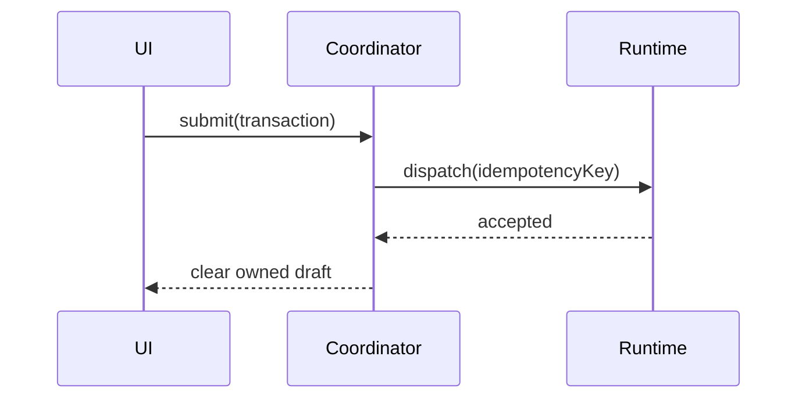

# Architecture Diagram

Start with the architectural decision or behavior the diagram must explain. Name component ownership and connectors in prose, then emit one focused Mermaid diagram.

Suitable diagrams:

- `flowchart` for components and dependency direction.
- `sequenceDiagram` for request, event, retry, and recovery behavior.
- `stateDiagram-v2` for lifecycle state machines.
- `gitGraph` only for simple branch explanations.

Keep node labels concise. Do not add click callbacks, HTML scripts, remote images, or untrusted links. Follow the diagram with a plain-text reading order and key tradeoffs.
