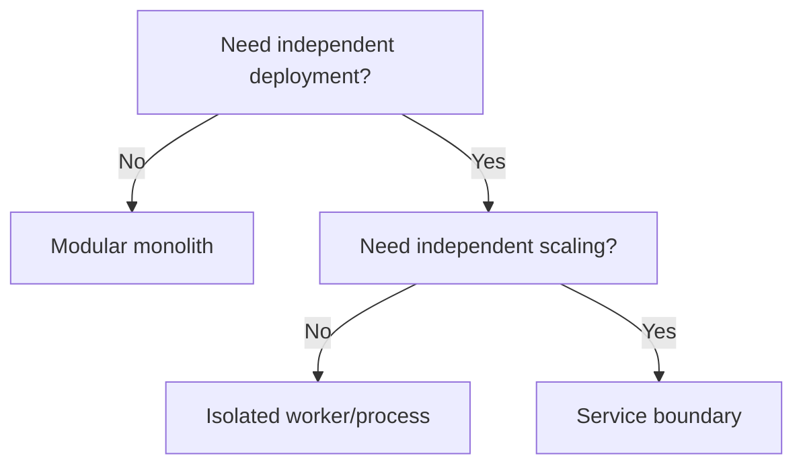

# Decision Map

Define the decision, hard constraints, evaluation criteria, and rejected alternatives. Recommend one option only after showing the tradeoffs.

For branching logic, use a compact Mermaid flowchart:

For scored evidence, use `vega-lite` with a small inline dataset. State that scores are judgments unless they come from measured data. End with consequences, rollback conditions, and the next verification step.
