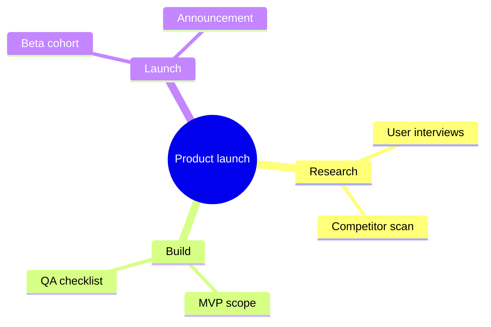

# Mind Map

Use when the user needs a brainstorm, topic tree, or concept hierarchy — not a sequence or deployment diagram.

## Rules

- One central root theme; keep each node label short (a few words).
- Prefer 2–4 levels; split very wide branches into a second diagram if needed.
- Use Mermaid `mindmap` only — no `click`, HTML, scripts, or remote images.
- After the diagram, add a plain-text bullet outline so the structure is readable without the graphic.

## Example

**Outline**

- Product launch
  - Research → user interviews, competitor scan
  - Build → MVP scope, QA checklist
  - Launch → beta cohort, announcement
